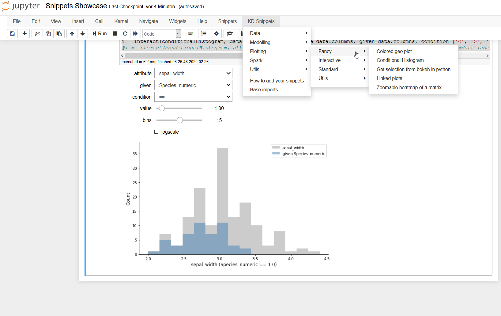
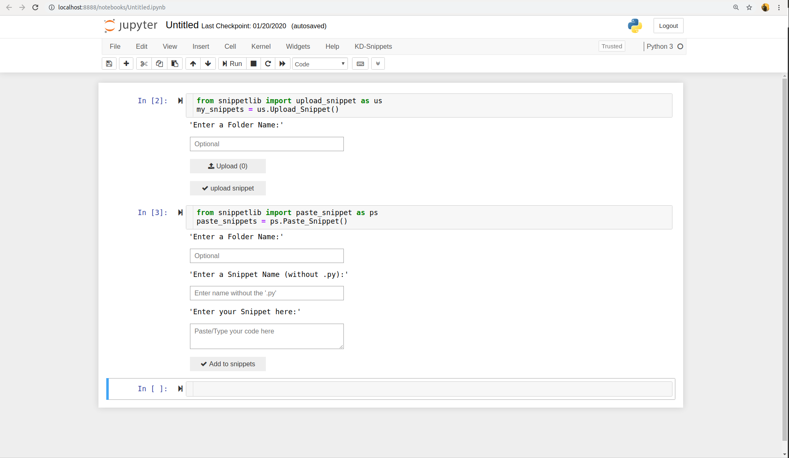

# Jupyter Notebook Menu Extensions

----

The idea of the Snippet Library is to create a tool for rapid prototyping with the aim of quickly and easily developing data analysis workflows. It adds a customizable menu to the Jupyter notebooks to insert code snippets, code examples and boilerplate code.

This Jupyter extension is based on the [Jupyter notebook snippets menu](https://github.com/moble/jupyter_boilerplate) extension, which adds one ore more menu items after the `Help` menu in Jupyter notebooks. The menu provides small code snippets which are supposed to make your life easiser when playing around with data. How do I read a `csv` file? There´s a snippet for that. How do I visualize missing values in a pandas dataframe? There´s a snippet for that. How do I plot the correlation matrix of my pandas dataframe (and make it look good)?. There's a snippet for that. You get the idea.

Focus of the provided snippets is helping to get started (or to get more productive) on data science tasks. The menu provides several snippets ordered by typical task groups used for exploring and visualizing data. 

The default menu provides the items:
* `Data` which provides snippets to read, write and transform data
* `Modelling` which provides snippets to train ML models (mostly based on `sklearn`). You'll find examples for classification, regression and clustering
* `Plotting` which provides some regularly used snippets for `matplotlib`, `bokeh` and the `pandas` interface
* `Utils` which provides some snippets which do not fit into the former categories but are still helpful

As described below, there's also the possibility to add your own snippets, either by copy-pasting them or by reading them from a `.py` file.

# Configuration 

The follwoing Prerequisites must be installed: 

`Anaconda` 

`(Python 3.X)`

 `Git`.

After installation enter the following in the three lines in the command line (Anaconda Prompt for Windows):

1. jupyter nbextension install --py snippetlib --sys-prefix
2. jupyter nbextension enable --py snippetlib --sys-prefix
3. jupyter serverextension enable --py snippetlib --sys-prefix

## Install via Make (Linux)

` git clone https://github.com/fraunhofer-iais/IAIS-Jupyter-Snippets-Extension.git`

` cd snippetlibrary`

` git checkout master`

` make install`

# Operating instructions
## Start Jupyter Notebook 

• **Windows**: Open Anaconda prompt and type "jupyter notebook".

• **Linux**: Open terminal and type "jupyter notebook“.

• **The Jupyter front-end should open in a browser window**.

## How to add your own snippets

To upload a new snippet on the jupyter notebook,paste the following in a new cell. 
`from snippetlib import upload_snippet as us`

`upload_snippets = us.Upload_Snippet()` 

Refresh the page and on the Snippets menu you should see the newly added snippet.

To create new snippets,on the jupyter notebook,paste the following in a new cell.

`from snippetlib import paste_snippet as ps `

`paste_snippets = ps.Paste_Snippet()`

Refresh the page and on the Snippets menu you should see the newly added snippet.

# Credits and Acknolegements
The development of this Jupyter extension was supported by the Fraunhofer Lighhouse Project [Machine Learning for Production (ML4P)](https://www.fraunhofer.de/de/forschung/fraunhofer-initiativen/fraunhofer-leitprojekte/ml4p.html). The main development has been carried out by the Knowledge Discovery Department of the [Fraunhofer IAIS](https://www.iais.fraunhofer.de).

# Contact information
If you're interested in supporting the further development of this extension or if you need support for the usage please contact [snippets@iais.fraunhofer.de](mailto:snippets@iais.fraunofer.de).

